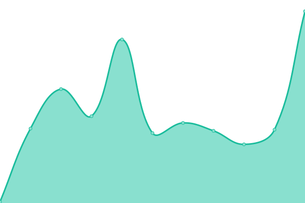
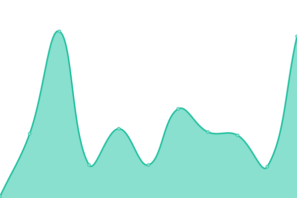

# [📈 Live Status](https://status.icarephone.com): <!--live status--> **🟩 All systems operational**

This repository contains the open-source uptime monitor and status page for [Upptime](https://upptime.js.org), powered by [Upptime](https://github.com/upptime/upptime).

With [Upptime](https://upptime.js.org), you can get your own unlimited and free uptime monitor and status page, powered entirely by a GitHub repository. We use [Issues](https://github.com/upptime/upptime/issues) as incident reports, [Actions](https://github.com/upptime/upptime/actions) as uptime monitors, and [Pages](https://status.icarephone.com) for the status page.

<!--start: status pages-->
<!-- This summary is generated by Upptime (https://github.com/upptime/upptime) -->
<!-- Do not edit this manually, your changes will be overwritten -->

| URL                                      | Status | History                                                                                         | Response Time                                                                     | Uptime                                                                                                                                                                                                               |
| ---------------------------------------- | ------ | ----------------------------------------------------------------------------------------------- | --------------------------------------------------------------------------------- | -------------------------------------------------------------------------------------------------------------------------------------------------------------------------------------------------------------------- |
| [Icarephone](https://www.icarephone.com) | 🟩 Up  | [icarephone.yml](https://github.com/icarephone/upptime/commits/master/history/icarephone.yml)   |  1260ms  |   |
| [Git](https://git.icarephone.com)        | 🟩 Up  | [git.yml](https://github.com/icarephone/upptime/commits/master/history/git.yml)                 |  853ms          |                  |
| [Proxy](https://proxy.icarephone.com)    | 🟩 Up  | [proxy.yml](https://github.com/icarephone/upptime/commits/master/history/proxy.yml)             |  3001ms       |              |
| [Bot](https://bot.icarephone.com)        | 🟩 Up  | [bot.yml](https://github.com/icarephone/upptime/commits/master/history/bot.yml)                 |  1365ms         |                 |
| Secret Site                              | 🟩 Up  | [secret-site.yml](https://github.com/icarephone/upptime/commits/master/history/secret-site.yml) |  1305ms |  |

<!--end: status pages-->

[**Visit our status website →**](https://status.icarephone.com)

## 📄 License

- Code: [MIT](./LICENSE) © [Upptime](https://upptime.js.org)
- Data in the `./history` directory: [Open Database License](https://opendatacommons.org/licenses/odbl/1-0/)
